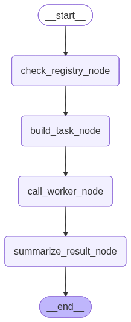

# Multi-Agent Research System

A modular multi-agent system for automated academic research, built with [LangGraph](https://github.com/langchain-ai/langgraph) and [LangChain](https://github.com/langchain-ai/langchain). A **Supervisor Agent** orchestrates a team of **Expert Agents** that search bibliographies and retrieve new papers — communicating through a shared **Blackboard** and tracked via a central **Agent Registry**.



## Architecture

- **Expert Agents** — Specialized workers (e.g. `LibrarianAgent` for Zotero search, `ResearcherAgent` for arXiv). Each agent self-registers on startup.
- **Supervisor** — A LangGraph state machine that routes tasks to the right expert and assembles the final result.
- **Blackboard** — A shared knowledge store for inter-agent communication and persistent state.
- **Agent Registry** — Runtime registry that tracks all active agents and their capabilities.
- **Observability** — Full trace logging via [Langfuse](https://langfuse.com).

## Prerequisites

- Python 3.10 or higher
- A [Groq](https://console.groq.com) API key (required — used as the primary LLM provider)
- Optionally: Zotero account, Tavily API key, Langfuse account

## Setup

### 1. Clone the repository

```bash
git clone <your-repo-url>
cd <repo-folder>
```

### 2. Create and activate a virtual environment

**Windows:**
```bash
python -m venv venv
venv\Scripts\activate
```

**macOS / Linux:**
```bash
python -m venv venv
source venv/bin/activate
```

### 3. Install dependencies

```bash
pip install -r requirements.txt
```

### 4. Configure environment variables

Copy the example file and fill in your API keys:

```bash
cp .env.example .env
```

Then open `.env` and add your keys:

| Variable | Required | Description |
|---|---|---|
| `GROQ_API_KEY` | Yes | LLM provider — get it at [console.groq.com](https://console.groq.com) |
| `ZOTERO_API_KEY` | Yes* | Zotero bibliography access — [zotero.org/settings/keys](https://www.zotero.org/settings/keys) |
| `ZOTERO_LIBRARY_ID` | Yes* | Your Zotero library ID (found in the same settings page) |
| `TAVILEY_API_KEY` | Yes* | Web search via Tavily — [tavily.com](https://tavily.com) |
| `LANGFUSE_SECRET_KEY` | No | Observability tracing — [cloud.langfuse.com](https://cloud.langfuse.com) |
| `LANGFUSE_PUBLIC_KEY` | No | Observability tracing |
| `LANGFUSE_BASE_URL` | No | Defaults to `https://cloud.langfuse.com` |
| `OLLAMA_BASE_URL` | No | Local Ollama instance — defaults to `http://localhost:11434` |

*Required only if using the corresponding agent (LibrarianAgent needs Zotero, ResearcherAgent needs Tavily).

## Running the system

```bash
python -m src.main
```

`src/main.py` has two modes — edit the file to choose which one runs:

- **Full supervisor run** — the supervisor orchestrates all expert agents end-to-end (active by default).
- **Direct agent test** — uncomment the `TEST` section to invoke a single agent directly with a research topic, useful for isolated debugging.

## Project structure

```
src/
├── main.py                        # Entry point
├── agents/
│   ├── experts/
│   │   ├── base.py                # Abstract BaseAgent (extend this)
│   │   ├── librarian.py           # LibrarianAgent — Zotero search
│   │   ├── researcher.py          # ResearcherAgent — arXiv search
│   │   └── your_expert.py         # Template for new expert agents
│   ├── supervisor/
│   │   ├── research_supervisor.py # Main supervisor graph
│   │   └── your_supervisor.py     # Template for custom supervisors
│   ├── prompts/
│   │   └── prompts.py             # System prompts for all agents
│   └── tools/
│       └── tools.py               # LangChain tool definitions
├── blackboard/
│   └── blackboard.py              # Shared inter-agent knowledge store
├── config/
│   └── config.py                  # LLM factory and settings
├── observability/
│   └── observer.py                # Langfuse tracing handler
└── registry/
    └── agent_registry/            # Runtime agent registration
```
